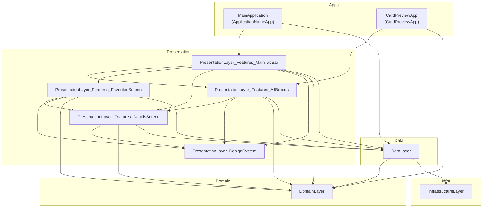
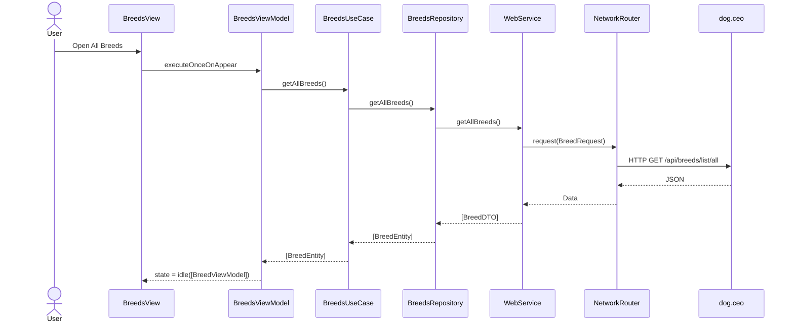
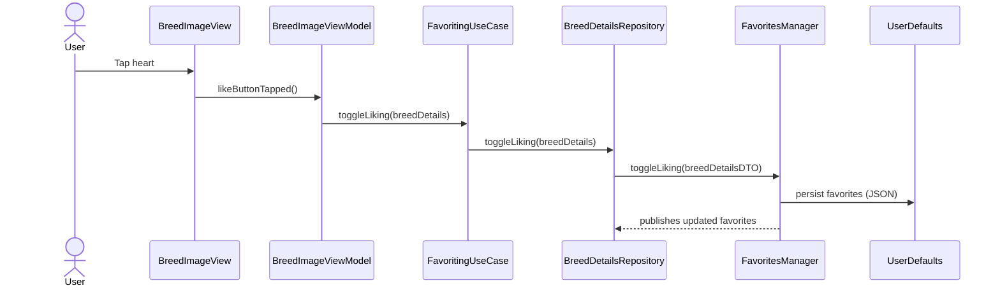

# Modulazied iOS App Tamplate

A demo for trying out new APIs and iOS ideas.
This project showcases the setup of a SwiftUI app with modularized Clean Architecture.
It can be used as a starting point for a project. Simply delete unneeded targets/packages and rename entities as needed.

## Key features

* Vanilla **SwiftUI** implementation
* Decoupled **Presentation**, **Business Logic**, and **Data Access** layers
* **Modularized** with SPM - Designed for scalability. It can be used as a reference for building large production apps
* Simple yet flexible vanila **Networking Layer** built on Generics
* Unit Test Coverage with **Swift Testing**
* Reactive State Management of shared state with **Combine**

## Architecture Quick View

### System Overview

For the full set of diagrams, see `docs/architecture.md`.

### Main Flow: All Breeds

### Favorites Toggle

  
