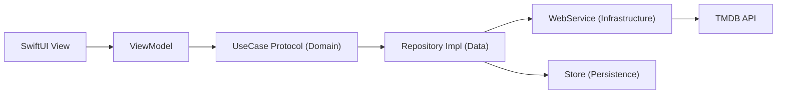
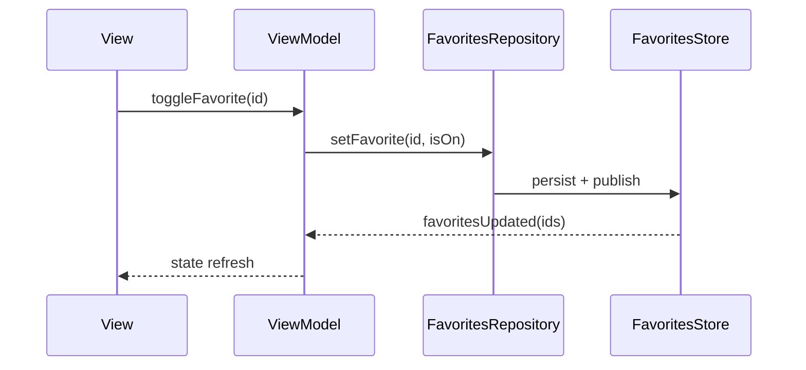
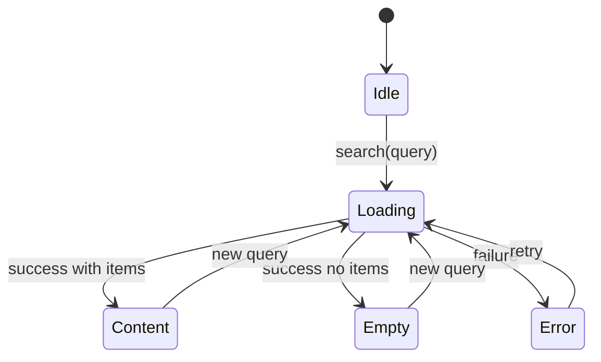

# Interview Prep Pack (TMDB Assignment)

Use this as your mock script and speaking notes.

## 1) 60-Minute Plan (What to Say in Each Block)

1. **0:00-5:00 Project Overview**
   - "I built a layered SwiftUI app with clean boundaries: Presentation, Domain, Data, Infrastructure."
   - "Main goals were testability, dependency inversion, and safe data mapping from TMDB DTOs into app entities."
   - "Primary flows: home rails, search, details, trailers, favorites persistence."
2. **5:00-20:00 Architecture + Dependency Flow**
   - Explain dependency direction and where protocols live.
   - Show DI composition root and module registration.
3. **20:00-30:00 Networking + Mapping**
   - Explain `WebService`, request construction, decoding, error handling.
   - Explain DTO-to-Entity mapping and why UI never sees DTOs.
4. **30:00-40:00 SwiftUI State Management**
   - Explain ViewModel ownership of loading/error/content states.
   - Explain search and favorites reactive updates.
5. **40:00-50:00 Testing**
   - Explain priority of ViewModel tests + mapper tests + repository tests.
   - Explain use of mocks for deterministic behavior.
6. **50:00-60:00 Tradeoffs + Improvements**
   - Discuss intentional choices and next iteration plan.

## 2) Architecture Visual (Use Early)

**Talking line:** "Views never call networking directly; they only call ViewModel methods. Each layer has one responsibility."

## 3) Full Interview Q&A (Strong Answer Script)

### Q1. Walk me through your architecture.

**Answer:**  
"I use strict layered architecture: Presentation (SwiftUI + ViewModels), Domain (entities + use case protocols), Data (repository implementations + mappers), and Infrastructure (networking/web service and low-level concerns).  
Dependency direction is inward: Presentation depends on Domain contracts, Data implements those contracts, Infrastructure supports Data.  
DI is wired in `/Users/luda/Documents/Developer/Movies/Submodules/Sources/DataLayer/DIContainerRegistration/DIContainerRegistration.swift` and resolved from app dependencies/composition root. This keeps creation centralized and makes modules replaceable in tests."

### Q2. Why separate UseCases if some are thin wrappers?

**Answer:**  
"Even thin use cases make business capabilities explicit at the API boundary of the Domain layer.  
That gives me stable contracts for ViewModel tests and avoids leaking repository details into presentation.  
It also future-proofs policy logic: if ranking, filtering, authorization, or caching rules change, I update the use case behavior without rewriting views."

### Q3. How favorites persistence works?

**Answer:**  
"Favorites flow through a repository-store split.  
`FavoritesRepository` exposes domain-friendly methods and delegates persistence and publishing to `FavoritesStore`.  
ViewModels subscribe to favorites updates and map IDs to UI state so different screens stay synchronized.  
This is why toggling favorite in details can reflect back in grid/home when subscriptions are correctly wired on the main thread."

### Q4. Explain DTO vs Entity in your app.

**Answer:**  
"DTOs mirror external payloads and can include API-specific optionality and naming.  
Entities are app-level models shaped for product behavior and UI needs.  
Mapping functions form an anti-corruption layer between them.  
This prevents TMDB schema details from leaking across the app and keeps UI logic stable even if backend fields evolve."

### Q5. How do you pick trailer URLs?

**Answer:**  
"I decode trailer DTOs, filter for valid playable candidates, prioritize YouTube entries with usable keys, then select best-fit trailer using metadata heuristics.  
The ranking policy is isolated so it can evolve independently, for example to prefer official trailers or higher-quality formats."

### Q6. How do you avoid direct networking in views?

**Answer:**  
"Views only call ViewModel intents like `onAppear`, `reload`, `search(query:)`, `toggleFavorite`.  
ViewModels depend on use case protocols, not concrete networking classes.  
Concrete repositories and web services are injected by DI.  
That decoupling keeps UI testable and avoids hidden side effects in SwiftUI views."

### Q7. How is search implemented?

**Answer:**  
"Search text is view state/binding.  
On intent, ViewModel executes `search(query:)`, manages loading/error/empty/content states, and publishes items for rendering.  
The grid and title react to whether search is active.  
Behavior for empty query is explicit and test-covered to avoid stale UI."

### Q8. How do you handle empty/missing media data?

**Answer:**  
"I normalize missing fields during mapping and ViewModel formatting.  
Examples: fallback title `Untitled`, fallback rating text `No rating`, placeholder image when URLs are missing.  
This keeps views simple and prevents optional-heavy rendering logic from spreading."

### Q9. What test coverage did you prioritize?

**Answer:**  
"Priority was behavior with highest regression risk:
1. ViewModel state transitions and user intents (loading, error, retries, favorite toggles).
2. Mapper tests to verify DTO-to-Entity normalization and fallback behavior.
3. Repository/network tests for decoding, request flow, and error propagation.  
I isolate dependencies with mocks so tests are deterministic and fast."

### Q10. What would you improve next?

**Answer:**  
"Next improvements:
1. DI wiring integration tests to catch mis-registrations early.
2. Feature-level analytics/logging policies with structured events.
3. Consolidation of duplicated state transition code in presentation.
4. Expanded image cache tests including TTL expiry and eviction."

## 4) Live Debugging Scenarios (What to Do + What to Say)

### Scenario A: `SearchMediaGridViewModel has no member queryText`

**Answer script:**  
"This looks like API drift after ViewModel refactor. Tests still target removed properties.  
I'd update tests to interact through current public API (`search(query:)`) and preserve behavior assertions: empty query clears state, non-empty query loads and maps results."

### Scenario B: Favorites update in details but not grid

**Answer script:**  
"I'd verify three points:
1. Grid ViewModel is subscribed to favorites publisher.
2. Mapping from favorite IDs to card state is applied on updates.
3. Publisher delivery is on main thread before published state mutation.  
If any is missing, grid will render stale favorite badges."

### Scenario C: Hero image ratio incorrect

**Answer script:**  
"I'd inspect whether details screen is using poster vs backdrop consistently, then verify `aspectRatio`, `scaledToFill`, and clipping/frame constraints.  
Placeholders must use identical layout constraints to avoid size jumps or black-band artifacts."

## 5) Red Flags to Avoid + Better Replacements

1. Avoid: "I call API directly from the view for simple cases."  
   Use: "Views dispatch intents to ViewModels; side effects stay outside UI."
2. Avoid: "Design system is optional."  
   Use: "Tokens/styles are centralized for consistency and change safety."
3. Avoid: "I didn't test; UI looked fine."  
   Use: "I prioritized ViewModel and mapper tests to lock core behavior."
4. Avoid: "I'm not sure where DI is configured."  
   Use: "DI is registered in the container registration module and resolved at composition root."

## 6) File Walkthrough Order (Open During Interview)

1. `/Users/luda/Documents/Developer/Movies/Submodules/Sources/DataLayer/DIContainerRegistration/DIContainerRegistration.swift`
2. `/Users/luda/Documents/Developer/Movies/Submodules/Sources/PresentationLayer/Features/HomeView/HomeView.swift`
3. `/Users/luda/Documents/Developer/Movies/Submodules/Sources/PresentationLayer/Features/MediaGrid/SearchMediaGrid/SearchMediaGridViewModel.swift`
4. `/Users/luda/Documents/Developer/Movies/Submodules/Sources/DataLayer/Repositories/MediasRepository.swift`
5. `/Users/luda/Documents/Developer/Movies/Submodules/Sources/InfrastructureLayer/Networking/WebService.swift`

## 7) 2-Minute Closing Pitch (Memorize)

"I designed the app so product behavior is isolated from transport and UI details.  
The key choices were protocol-driven Domain contracts, DTO-to-Entity mapping boundaries, and DI-based composition for testability.  
This gave me predictable state handling for SwiftUI, reactive favorites sync, and focused tests around behavior rather than implementation.  
If I continue, I'll strengthen integration tests around DI and expand observability and cache-policy validation."
